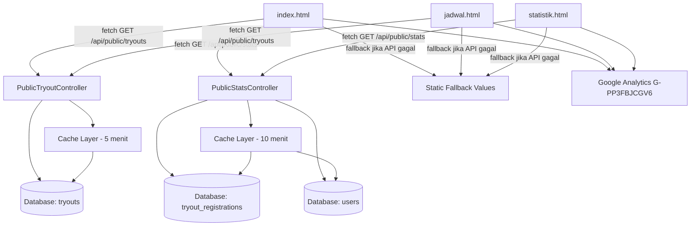
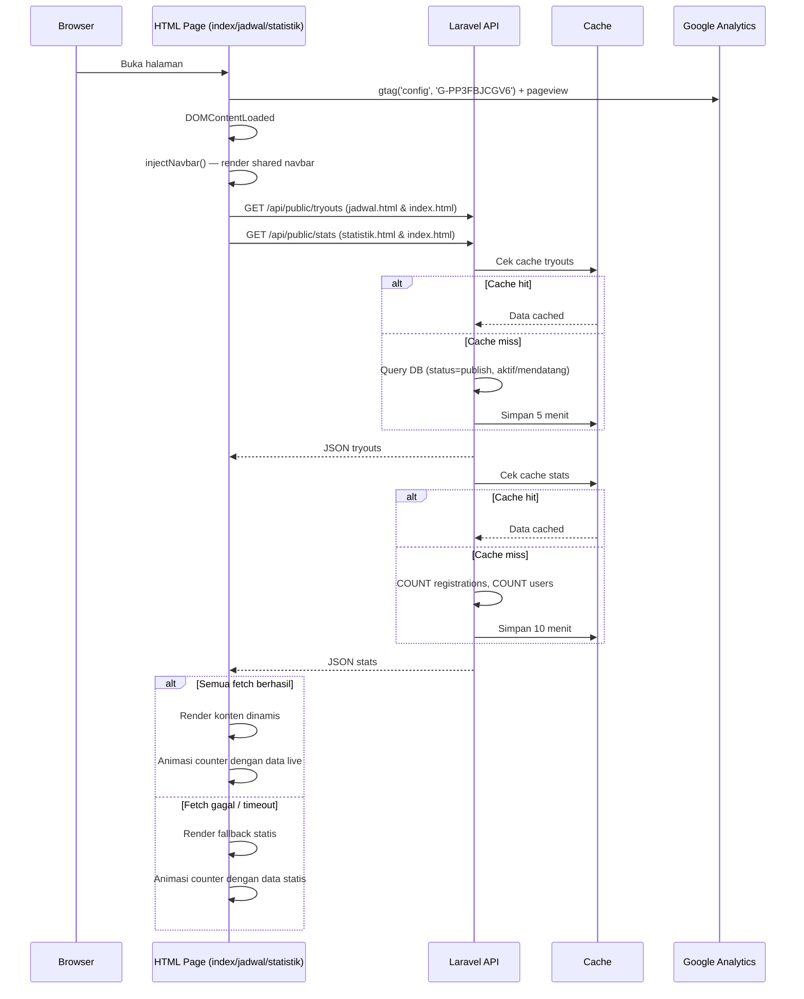
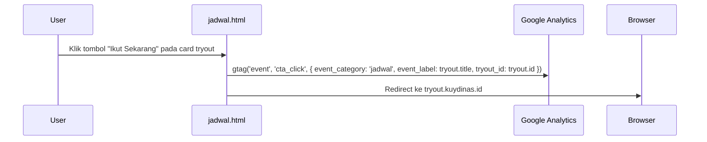

# Design Document: Blog Timeline dan Statistik

## Overview

Fitur ini memperluas blog statis (`kuydinas_blog_v5/`) menjadi **multi-halaman** dengan tiga halaman utama: `index.html` (landing page), `jadwal.html` (halaman jadwal tryout), dan `statistik.html` (halaman statistik platform). Setiap halaman memiliki SEO yang dioptimalkan (title unik, meta description, Open Graph, JSON-LD structured data), Google Analytics event tracking, dan navbar responsif yang konsisten. Untuk mendukung konten dinamis, dua endpoint API publik baru dibuat di Laravel: `GET /api/public/tryouts` dan `GET /api/public/stats`, tanpa autentikasi dan dengan rate limiting.

## Architecture

### Sitemap Multi-Halaman

```
kuydinas_blog_v5/
├── index.html          → Landing page utama (hero, fitur, social proof, teaser jadwal & statistik)
├── jadwal.html         → Halaman jadwal tryout lengkap
├── statistik.html      → Halaman statistik platform lengkap
└── assets/
    └── navbar.js       → Shared navbar component (inject via JS)
```

### Arsitektur Sistem



## Sequence Diagrams

### Alur Fetch Data Blog (Semua Halaman)



### Alur Event Tracking Google Analytics



## Components and Interfaces

### Component 1: PublicTryoutController (Laravel)

**Purpose**: Menyajikan daftar tryout yang sudah dipublish dan aktif/mendatang untuk konsumsi publik tanpa autentikasi.

**Interface**:

```
GET /api/public/tryouts

Response 200:
{
  "status": true,
  "data": [
    {
      "id": integer,
      "title": string,
      "type": "free" | "premium" | "regular",
      "duration": integer,          // menit
      "free_start_date": string | null,   // ISO 8601 date
      "free_valid_until": string | null,  // ISO 8601 date
      "status_label": "upcoming" | "active" | "ended",
      "quota": integer | null,
      "registrations_count": integer
    }
  ],
  "meta": {
    "cached_at": string,
    "total": integer
  }
}
```

**Responsibilities**:

- Filter hanya tryout dengan `status = 'publish'`
- Filter hanya tryout yang `status_label` bukan `ended` (kecuali 7 hari terakhir untuk context)
- Hitung `status_label` berdasarkan `free_start_date` dan `free_valid_until` vs waktu sekarang
- Tidak expose: `price`, `discount`, `info_ig`, `info_wa`, data soal, data user
- Cache hasil 5 menit dengan key `public_tryouts`

### Component 2: PublicStatsController (Laravel)

**Purpose**: Menyajikan statistik agregat platform untuk social proof di blog.

**Interface**:

```
GET /api/public/stats

Response 200:
{
  "status": true,
  "data": {
    "total_registrations": integer,   // total semua registrasi tryout
    "total_completed": integer,       // total yang sudah selesai mengerjakan
    "total_users": integer            // total akun terdaftar
  },
  "meta": {
    "cached_at": string
  }
}
```

**Responsibilities**:

- Hitung `total_registrations` dari tabel `tryout_registrations` (semua status)
- Hitung `total_completed` dari `tryout_registrations` dengan `status = 'completed'`
- Hitung `total_users` dari tabel `users`
- Tidak expose data individual user apapun
- Cache hasil 10 menit dengan key `public_stats`

### Component 3: Shared Navbar (Blog HTML)

**Purpose**: Navbar responsif yang konsisten di semua halaman (index.html, jadwal.html, statistik.html).

**Interface** (DOM yang di-inject via JS):

```html
<nav class="navbar">
    <!-- Logo -->
    <div class="navbar-brand">KD | Kuy Dinas</div>

    <!-- Desktop links -->
    <div class="navbar-links hidden lg:flex">
        <a href="index.html#fitur">Fitur</a>
        <a href="jadwal.html">Jadwal Tryout</a>
        <a href="statistik.html">Statistik</a>
        <a href="index.html#faq">FAQ</a>
    </div>

    <!-- Mobile hamburger -->
    <button class="navbar-hamburger lg:hidden" aria-label="Menu">☰</button>

    <!-- CTA -->
    <a href="https://tryout.kuydinas.id" class="navbar-cta">Mulai Tryout</a>

    <!-- Mobile dropdown (hidden by default) -->
    <div class="navbar-mobile-menu hidden">
        <a href="index.html#fitur">Fitur</a>
        <a href="jadwal.html">Jadwal Tryout</a>
        <a href="statistik.html">Statistik</a>
        <a href="index.html#faq">FAQ</a>
        <a href="https://tryout.kuydinas.id">Mulai Tryout</a>
    </div>
</nav>
```

**Responsibilities**:

- Di-inject ke `<header>` setiap halaman via `injectNavbar()` JavaScript function
- Highlight link aktif berdasarkan `window.location.pathname`
- Toggle mobile menu saat hamburger diklik
- CTA "Mulai Tryout" selalu tampil di semua breakpoint

### Component 4: Halaman `jadwal.html`

**Purpose**: Halaman dedicated yang menampilkan semua tryout aktif dan mendatang dengan detail lengkap, SEO optimal, dan GA event tracking.

**Layout**:

```
┌─────────────────────────────────────────┐
│ Navbar (shared)                         │
├─────────────────────────────────────────┤
│ Hero Section                            │
│   h1: "Jadwal Tryout CPNS Kuy Dinas"    │
│   Subtitle + breadcrumb                 │
├─────────────────────────────────────────┤
│ Filter Bar (Semua | Aktif | Akan Datang)│
├─────────────────────────────────────────┤
│ Grid Tryout Cards (dinamis dari API)    │
│   ┌──────────┐ ┌──────────┐ ┌────────┐ │
│   │ Card 1   │ │ Card 2   │ │ Card 3 │ │
│   │ [badge]  │ │ [badge]  │ │[badge] │ │
│   │ Judul    │ │ Judul    │ │ Judul  │ │
│   │ Tanggal  │ │ Tanggal  │ │Tanggal │ │
│   │ Durasi   │ │ Durasi   │ │Durasi  │ │
│   │ [CTA]    │ │ [CTA]    │ │ [CTA]  │ │
│   └──────────┘ └──────────┘ └────────┘ │
├─────────────────────────────────────────┤
│ CTA Banner: "Daftar Sekarang"           │
├─────────────────────────────────────────┤
│ Footer dengan internal links            │
└─────────────────────────────────────────┘
```

**SEO Structure**:

```html
<title>Jadwal Tryout CPNS 2025 | Kuy Dinas</title>
<meta
    name="description"
    content="Lihat jadwal tryout CPNS SKD terbaru di Kuy Dinas. Tryout gratis dan premium dengan simulasi CAT realistis, pembahasan lengkap, dan ranking nasional."
/>
<link rel="canonical" href="https://kuydinas.id/jadwal.html" />
<meta property="og:title" content="Jadwal Tryout CPNS 2025 | Kuy Dinas" />
<meta property="og:description" content="..." />
<meta property="og:url" content="https://kuydinas.id/jadwal.html" />
<meta property="og:image" content="https://kuydinas.id/og-jadwal.png" />

<!-- JSON-LD Event Schema (per tryout) -->
<script type="application/ld+json">
    {
        "@context": "https://schema.org",
        "@type": "Event",
        "name": "Tryout SKD CPNS Gratis",
        "startDate": "2025-08-01",
        "endDate": "2025-08-31",
        "eventStatus": "https://schema.org/EventScheduled",
        "eventAttendanceMode": "https://schema.org/OnlineEventAttendanceMode",
        "organizer": { "@type": "Organization", "name": "Kuy Dinas" }
    }
</script>
```

### Component 5: Halaman `statistik.html`

**Purpose**: Halaman dedicated yang menampilkan statistik platform secara lengkap sebagai social proof, dengan SEO optimal.

**Layout**:

```
┌─────────────────────────────────────────┐
│ Navbar (shared)                         │
├─────────────────────────────────────────┤
│ Hero Section                            │
│   h1: "Statistik Platform Kuy Dinas"    │
│   Subtitle                              │
├─────────────────────────────────────────┤
│ Stats Grid (live dari API)              │
│   ┌──────────┐ ┌──────────┐ ┌────────┐ │
│   │ Total    │ │ Selesai  │ │ User   │ │
│   │ Peserta  │ │ Tryout   │ │Terdaftar│ │
│   │ [counter]│ │ [counter]│ │[counter]│ │
│   └──────────┘ └──────────┘ └────────┘ │
├─────────────────────────────────────────┤
│ Testimonials Section                    │
├─────────────────────────────────────────┤
│ Social Proof Highlights                 │
│   (passing grade rate, bank soal, dll)  │
├─────────────────────────────────────────┤
│ CTA Banner                              │
├─────────────────────────────────────────┤
│ Footer dengan internal links            │
└─────────────────────────────────────────┘
```

**SEO Structure**:

```html
<title>Statistik Platform Tryout CPNS | Kuy Dinas</title>
<meta
    name="description"
    content="Lebih dari 120.000 peserta sudah latihan di Kuy Dinas. Lihat statistik lengkap platform tryout CPNS terpercaya dengan simulasi CAT realistis."
/>
<link rel="canonical" href="https://kuydinas.id/statistik.html" />
<meta
    property="og:title"
    content="Statistik Platform Tryout CPNS | Kuy Dinas"
/>
<meta property="og:url" content="https://kuydinas.id/statistik.html" />

<!-- JSON-LD Organization Schema -->
<script type="application/ld+json">
    {
        "@context": "https://schema.org",
        "@type": "Organization",
        "name": "Kuy Dinas",
        "url": "https://kuydinas.id",
        "description": "Platform tryout CPNS dengan simulasi CAT realistis"
    }
</script>
```

### Component 6: Update `index.html`

**Purpose**: Tambah link ke halaman baru di navbar, tambah section teaser/preview untuk jadwal dan statistik.

**Perubahan**:

- Navbar: tambah link "Jadwal Tryout" → `jadwal.html` dan "Statistik" → `statistik.html`
- Navbar: tambah hamburger menu untuk mobile
- Section teaser jadwal: tampilkan 2-3 tryout terbaru dengan link "Lihat Semua Jadwal →"
- Section teaser statistik: tampilkan 3 angka utama dengan link "Lihat Statistik Lengkap →"
- Counter "Peserta latihan" diupdate dengan data live dari API

### Component 7: Google Analytics Event Tracking Plan

**Purpose**: Tracking user behavior di semua halaman untuk optimasi konversi.

**Events**:

```javascript
// Semua halaman: pageview (otomatis via gtag config)
gtag("config", "G-PP3FBJCGV6");

// jadwal.html: klik CTA "Ikut Sekarang" per tryout
gtag("event", "cta_click", {
    event_category: "jadwal",
    event_label: tryout.title,
    tryout_id: tryout.id,
    tryout_type: tryout.type, // free | premium
});

// jadwal.html: filter tab diklik
gtag("event", "filter_click", {
    event_category: "jadwal",
    event_label: filterValue, // 'semua' | 'aktif' | 'akan_datang'
});

// statistik.html: scroll ke stats section (engagement)
gtag("event", "stats_viewed", {
    event_category: "statistik",
    event_label: "stats_section_visible",
});

// index.html: klik "Lihat Semua Jadwal"
gtag("event", "internal_link_click", {
    event_category: "index",
    event_label: "lihat_semua_jadwal",
});

// index.html: klik "Lihat Statistik Lengkap"
gtag("event", "internal_link_click", {
    event_category: "index",
    event_label: "lihat_statistik_lengkap",
});
```

### Component 8: Section Timeline Tryout (Blog HTML — index.html & jadwal.html)

**Purpose**: Menampilkan jadwal tryout mendatang/aktif dalam format card yang menarik.

**Interface** (DOM):

```html
<section id="timeline-tryout">
    <!-- Card per tryout -->
    <div class="tryout-card" data-status="active|upcoming|ended">
        <span class="status-badge">Sedang Berlangsung | Akan Datang</span>
        <h3 class="tryout-title">...</h3>
        <div class="tryout-meta">
            <span class="tryout-type">Gratis | Premium</span>
            <span class="tryout-date">DD MMM YYYY – DD MMM YYYY</span>
            <span class="tryout-duration">90 menit</span>
        </div>
        <a
            href="https://tryout.kuydinas.id"
            class="cta-btn"
            onclick="trackCtaClick(tryout)"
            >Ikut Sekarang</a
        >
    </div>
</section>
```

**Responsibilities**:

- Fetch data dari `/api/public/tryouts` saat `DOMContentLoaded`
- Render card untuk setiap tryout yang diterima
- Tampilkan skeleton loading saat fetch berlangsung
- Sembunyikan section jika tidak ada tryout aktif/mendatang
- Graceful fallback: jika fetch gagal, sembunyikan section (tidak error)
- Di `jadwal.html`: tampilkan semua tryout dengan filter tab
- Di `index.html`: tampilkan maksimal 3 tryout terbaru sebagai teaser

### Component 9: Section Statistik Live (Blog HTML)

**Purpose**: Menggantikan counter statis dengan data live dari API, dengan fallback ke nilai statis.

**Interface** (DOM):

```html
<!-- Modifikasi counter yang sudah ada -->
<p data-counter="120000" data-live-key="total_registrations">0</p>
<p data-counter="3200" data-live-key="total_questions_static">0</p>
<p data-counter="94" data-live-key="passing_grade_static">0</p>
```

**Responsibilities**:

- Fetch data dari `/api/public/stats` saat `DOMContentLoaded`
- Jika berhasil: update `data-counter` dengan nilai live sebelum animasi counter berjalan
- Jika gagal/timeout (>3 detik): gunakan nilai `data-counter` statis yang sudah ada
- Animasi counter tetap menggunakan logika yang sudah ada

## Data Models

### PublicTryout (Response DTO)

```
{
  id: integer           // ID tryout
  title: string         // Judul tryout, max 255 char
  type: enum            // "free" | "premium" | "regular"
  duration: integer     // Durasi dalam menit
  free_start_date: date | null   // Tanggal mulai (untuk free tryout)
  free_valid_until: date | null  // Tanggal berakhir (untuk free tryout)
  status_label: enum    // "upcoming" | "active" | "ended"
  quota: integer | null // Kuota peserta, null = tidak terbatas
  registrations_count: integer   // Jumlah yang sudah daftar
}
```

**Validation Rules**:

- Hanya tryout dengan `status = 'publish'` yang dikembalikan
- `status_label` dihitung server-side, tidak disimpan di DB
- `registrations_count` adalah count dari relasi, bukan data sensitif

### PublicStats (Response DTO)

```
{
  total_registrations: integer   // >= 0
  total_completed: integer       // >= 0, <= total_registrations
  total_users: integer           // >= 0
}
```

**Validation Rules**:

- Semua nilai adalah integer non-negatif
- Tidak ada data PII (nama, email, dll)

## Algorithmic Pseudocode

### Algoritma Penentuan Status Label Tryout

```pascal
FUNCTION computeStatusLabel(tryout)
  INPUT: tryout dengan field type, free_start_date, free_valid_until
  OUTPUT: status_label ∈ {"upcoming", "active", "ended"}

  now ← Carbon::now()

  IF tryout.type = "free" THEN
    IF tryout.free_start_date IS NOT NULL AND now < tryout.free_start_date THEN
      RETURN "upcoming"
    END IF

    IF tryout.free_valid_until IS NOT NULL AND now > tryout.free_valid_until.endOfDay() THEN
      RETURN "ended"
    END IF

    RETURN "active"
  ELSE
    // Premium/regular: selalu aktif jika sudah publish
    RETURN "active"
  END IF
END FUNCTION
```

**Preconditions:**

- `tryout.status = 'publish'`
- `now` adalah waktu server saat request

**Postconditions:**

- Mengembalikan tepat satu dari tiga nilai enum
- Tryout free tanpa tanggal selalu "active"

### Algoritma Filter Tryout Publik

```pascal
FUNCTION getPublicTryouts()
  OUTPUT: array of PublicTryout

  tryouts ← Tryout::where("status", "publish")
               .withCount("registrations")
               .orderBy("free_start_date", "asc")
               .orderBy("created_at", "desc")
               .get()

  result ← []

  FOR each tryout IN tryouts DO
    label ← computeStatusLabel(tryout)

    // Sertakan "ended" hanya jika berakhir dalam 7 hari terakhir
    IF label = "ended" THEN
      cutoff ← now().subDays(7)
      IF tryout.free_valid_until < cutoff THEN
        CONTINUE  // Skip, terlalu lama berakhir
      END IF
    END IF

    result.append({
      id: tryout.id,
      title: tryout.title,
      type: tryout.type,
      duration: tryout.duration,
      free_start_date: tryout.free_start_date,
      free_valid_until: tryout.free_valid_until,
      status_label: label,
      quota: tryout.quota,
      registrations_count: tryout.registrations_count
    })
  END FOR

  RETURN result
END FUNCTION
```

**Loop Invariants:**

- Setiap tryout yang dimasukkan ke `result` sudah melewati filter status
- Tidak ada data sensitif (price, discount, soal) dalam result

### Algoritma Inject Navbar (JavaScript — Shared)

```pascal
FUNCTION injectNavbar(currentPage)
  INPUT: currentPage ∈ {"index", "jadwal", "statistik"}

  navLinks ← [
    { label: "Fitur",          href: "index.html#fitur",  page: "index" },
    { label: "Jadwal Tryout",  href: "jadwal.html",       page: "jadwal" },
    { label: "Statistik",      href: "statistik.html",    page: "statistik" },
    { label: "FAQ",            href: "index.html#faq",    page: "index" }
  ]

  navHTML ← buildNavbarHTML(navLinks, currentPage)
  document.querySelector("header").innerHTML ← navHTML

  // Attach hamburger toggle
  hamburgerBtn ← document.querySelector(".navbar-hamburger")
  mobileMenu ← document.querySelector(".navbar-mobile-menu")

  hamburgerBtn.addEventListener("click", () => {
    mobileMenu.classList.toggle("hidden")
  })
END FUNCTION

FUNCTION buildNavbarHTML(links, currentPage)
  // Highlight link aktif berdasarkan currentPage
  FOR each link IN links DO
    IF link.page = currentPage THEN
      link.activeClass ← "text-coral font-bold"
    ELSE
      link.activeClass ← "hover:text-coral"
    END IF
  END FOR

  RETURN navbar HTML string dengan links dan CTA button
END FUNCTION
```

### Algoritma Fetch dan Render di Blog (JavaScript)

```pascal
ASYNC FUNCTION initBlogDynamicData(options)
  INPUT: options = { fetchTryouts: boolean, fetchStats: boolean, maxTryouts: integer | null }

  promises ← []

  IF options.fetchTryouts THEN
    promises.push(fetchWithTimeout(API_BASE + "/api/public/tryouts", 3000))
  END IF

  IF options.fetchStats THEN
    promises.push(fetchWithTimeout(API_BASE + "/api/public/stats", 3000))
  END IF

  results ← await Promise.allSettled(promises)

  resultIndex ← 0

  IF options.fetchTryouts THEN
    tryoutsResult ← results[resultIndex]
    resultIndex ← resultIndex + 1

    IF tryoutsResult.status = "fulfilled" THEN
      renderTimelineSection(tryoutsResult.value.data, options.maxTryouts)
    ELSE
      hideTimelineSection()
    END IF
  END IF

  IF options.fetchStats THEN
    statsResult ← results[resultIndex]

    IF statsResult.status = "fulfilled" THEN
      updateCountersWithLiveData(statsResult.value.data)
    END IF
  END IF

  startCounterAnimations()
END FUNCTION

FUNCTION renderTimelineSection(tryouts, maxItems)
  INPUT: array of PublicTryout, maxItems (null = tampilkan semua)

  activeTryouts ← tryouts.filter(t => t.status_label ≠ "ended")

  IF activeTryouts.length = 0 THEN
    hideTimelineSection()
    RETURN
  END IF

  IF maxItems IS NOT NULL THEN
    activeTryouts ← activeTryouts.slice(0, maxItems)
  END IF

  container ← document.getElementById("timeline-tryout-grid")
  container.innerHTML ← activeTryouts.map(t => buildTryoutCard(t)).join("")
  showTimelineSection()
END FUNCTION

FUNCTION buildTryoutCard(tryout)
  // Attach GA event tracking ke CTA button
  ctaOnClick ← "gtag('event','cta_click',{event_category:'jadwal',event_label:'" + tryout.title + "',tryout_id:" + tryout.id + ",tryout_type:'" + tryout.type + "'})"

  RETURN HTML card string dengan badge, judul, tanggal, durasi, dan CTA dengan onclick tracking
END FUNCTION
```

**Preconditions:**

- DOM sudah siap (DOMContentLoaded)
- API base URL sudah dikonfigurasi

**Postconditions:**

- Timeline section tampil jika ada data, tersembunyi jika tidak
- Counter menggunakan data live jika tersedia, statis jika tidak
- Tidak ada uncaught exception yang merusak halaman
- GA events ter-fire saat CTA diklik

## Key Functions with Formal Specifications

### `PublicTryoutController::index()`

**Preconditions:**

- Request tidak memerlukan autentikasi
- Rate limit belum terlampaui (max 30 req/menit per IP)

**Postconditions:**

- Response berisi hanya tryout dengan `status = 'publish'`
- Tidak ada field sensitif (price, discount, soal, user data) dalam response
- Response di-cache 5 menit
- HTTP 200 selalu dikembalikan (array kosong jika tidak ada data)
- HTTP 429 jika rate limit terlampaui

### `PublicStatsController::index()`

**Preconditions:**

- Request tidak memerlukan autentikasi
- Rate limit belum terlampaui (max 30 req/menit per IP)

**Postconditions:**

- Response berisi tiga angka agregat non-negatif
- Tidak ada data individual user
- Response di-cache 10 menit
- HTTP 200 selalu dikembalikan

### `injectNavbar(currentPage)` (JavaScript)

**Preconditions:**

- `currentPage` adalah string valid: "index" | "jadwal" | "statistik"
- `<header>` element ada di DOM

**Postconditions:**

- Navbar ter-render di `<header>` dengan semua link navigasi
- Link aktif di-highlight sesuai `currentPage`
- Hamburger toggle berfungsi di mobile
- CTA "Mulai Tryout" selalu tampil

### `fetchWithTimeout(url, ms)` (JavaScript)

**Preconditions:**

- `url` adalah string URL valid
- `ms` adalah integer positif (timeout dalam milidetik)

**Postconditions:**

- Mengembalikan Promise yang resolve dengan parsed JSON jika berhasil
- Mengembalikan Promise yang reject jika timeout atau network error
- Tidak pernah throw uncaught exception

### `trackCtaClick(tryout)` (JavaScript)

**Preconditions:**

- `window.gtag` tersedia (GA sudah di-load)
- `tryout` memiliki field `id`, `title`, `type`

**Postconditions:**

- GA event `cta_click` ter-fire dengan parameter yang benar
- Tidak memblokir navigasi ke URL tujuan

## Error Handling

### Error Scenario 1: API Tidak Tersedia

**Kondisi**: Blog tidak bisa menjangkau API (network error, server down)
**Response**: `fetchWithTimeout` reject setelah 3 detik
**Recovery**: Timeline section disembunyikan; counter menggunakan nilai statis dari `data-counter` attribute

### Error Scenario 2: API Lambat (>3 detik)

**Kondisi**: API merespons tapi lebih dari 3 detik
**Response**: `AbortController` membatalkan request
**Recovery**: Sama dengan Error Scenario 1

### Error Scenario 3: Rate Limit Terlampaui

**Kondisi**: IP mengirim >30 request/menit ke endpoint publik
**Response**: HTTP 429 Too Many Requests
**Recovery**: Blog fallback ke data statis; tidak ada error yang ditampilkan ke user

### Error Scenario 4: Tidak Ada Tryout Aktif

**Kondisi**: API berhasil tapi tidak ada tryout publish yang aktif/mendatang
**Response**: `data: []` dengan HTTP 200
**Recovery**: Section timeline disembunyikan dengan `display: none`; di `jadwal.html` tampilkan pesan "Belum ada tryout aktif saat ini"

### Error Scenario 5: CORS Error

**Kondisi**: Blog di domain berbeda dari API, CORS tidak dikonfigurasi
**Response**: Browser memblokir request
**Recovery**: Perlu konfigurasi CORS di Laravel untuk mengizinkan origin blog; fallback ke statis jika belum dikonfigurasi

### Error Scenario 6: GA Tidak Ter-load

**Kondisi**: Google Analytics script gagal dimuat (ad blocker, network error)
**Response**: `window.gtag` undefined
**Recovery**: Event tracking di-skip dengan pengecekan `if (typeof gtag !== 'undefined')` sebelum fire event; halaman tetap berfungsi normal

## Testing Strategy

### Unit Testing Approach

**Laravel (PHPUnit)**:

- Test `computeStatusLabel` dengan berbagai kombinasi tanggal
- Test filter tryout: hanya `status = 'publish'` yang lolos
- Test tidak ada field sensitif dalam response
- Test cache key dan TTL

**JavaScript**:

- Test `fetchWithTimeout` dengan mock fetch yang lambat
- Test `renderTimelineSection` dengan array kosong
- Test `updateCountersWithLiveData` dengan data valid dan invalid
- Test `injectNavbar` menghasilkan HTML yang benar untuk setiap `currentPage`
- Test `trackCtaClick` memanggil `gtag` dengan parameter yang benar

### Property-Based Testing Approach

**Property Test Library**: PHPUnit dengan data provider

**Properties yang diuji**:

1. ∀ tryout dalam response publik: `tryout.status = 'publish'`
2. ∀ tryout dalam response publik: tidak ada field `price`, `discount`, `info_ig`, `info_wa`
3. ∀ stats response: `total_completed ≤ total_registrations`
4. ∀ stats response: semua nilai ≥ 0
5. ∀ tryout dengan `free_start_date > now`: `status_label = 'upcoming'`
6. ∀ tryout dengan `free_valid_until < now`: `status_label = 'ended'`

### Integration Testing Approach

- Test endpoint `/api/public/tryouts` tanpa token → HTTP 200
- Test endpoint `/api/public/stats` tanpa token → HTTP 200
- Test rate limiting: 31 request berturut-turut → request ke-31 HTTP 429
- Test CORS header ada di response untuk origin blog

### Manual Testing Checklist

**SEO**:

- [ ] Setiap halaman punya `<title>` unik
- [ ] Meta description ada dan relevan per halaman
- [ ] Open Graph tags lengkap
- [ ] Canonical URL benar
- [ ] JSON-LD structured data valid (test via Google Rich Results Test)
- [ ] Heading hierarchy benar (h1 → h2 → h3, tidak skip level)
- [ ] Internal links antar halaman berfungsi

**Google Analytics**:

- [ ] Pageview ter-track di semua halaman (cek GA Realtime)
- [ ] Event `cta_click` ter-fire saat klik "Ikut Sekarang" di jadwal.html
- [ ] Event `filter_click` ter-fire saat klik tab filter di jadwal.html
- [ ] Event `stats_viewed` ter-fire saat scroll ke stats section di statistik.html

**Navbar**:

- [ ] Navbar tampil konsisten di index.html, jadwal.html, statistik.html
- [ ] Link aktif di-highlight sesuai halaman
- [ ] Hamburger menu berfungsi di mobile (< 640px)
- [ ] CTA "Mulai Tryout" tampil di semua breakpoint

**Responsivitas**:

- [ ] Semua halaman tampil baik di mobile (320px - 640px)
- [ ] Semua halaman tampil baik di tablet (640px - 1024px)
- [ ] Tidak ada horizontal overflow di mobile

## Performance Considerations

- **Cache**: Kedua endpoint menggunakan Laravel Cache (Redis/file) dengan TTL berbeda:
    - `/api/public/tryouts`: 5 menit (data berubah lebih sering)
    - `/api/public/stats`: 10 menit (angka agregat, tidak perlu real-time)
- **Query optimization**: `withCount('registrations')` menggunakan single JOIN query, bukan N+1
- **Blog fetch**: Menggunakan `Promise.allSettled` untuk fetch paralel, tidak sequential
- **Timeout**: 3 detik timeout mencegah blog hang jika API lambat
- **Payload size**: Response publik minimal, tidak ada data soal atau user

## Security Considerations

- **No auth required**: Endpoint publik tidak memerlukan token, tapi hanya expose data non-sensitif
- **Rate limiting**: `throttle:30,1` (30 request per menit per IP) mencegah scraping berlebihan
- **Data minimization**: Tidak expose `price`, `discount`, `info_ig`, `info_wa`, data soal, atau data user individual
- **No PII**: Stats hanya berupa angka agregat, tidak ada nama/email
- **CORS**: Konfigurasi CORS hanya mengizinkan origin blog (`kuydinas.id`) dan localhost untuk development
- **Cache poisoning**: Cache key tidak mengandung input user, tidak ada risiko cache poisoning

## Dependencies

### Laravel (kuydinas_api_v5)

- `App\Models\Tryout` — model yang sudah ada
- `App\Models\TryoutRegistration` — model yang sudah ada
- `App\Models\User` — model yang sudah ada
- `Illuminate\Support\Facades\Cache` — sudah tersedia
- `throttle` middleware — sudah tersedia di Laravel
- CORS: `fruitcake/laravel-cors` atau konfigurasi native Laravel 9+ (`config/cors.php`)

### Blog HTML (kuydinas_blog_v5)

- Tailwind CSS via CDN — sudah ada
- Vanilla JavaScript (ES2020+) — tidak ada dependency baru
- `fetch` API + `AbortController` — native browser, tidak perlu library
- `Promise.allSettled` — native browser (ES2020), didukung semua browser modern
- Google Analytics (G-PP3FBJCGV6) — sudah ada di index.html, perlu ditambahkan ke halaman baru
- Google Fonts (Plus Jakarta Sans) — sudah ada di index.html, perlu ditambahkan ke halaman baru
